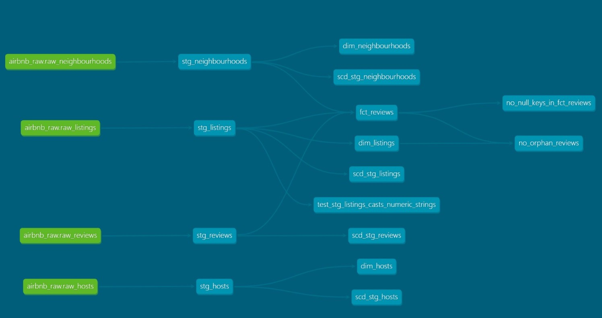

# Airbnb dbt Project

## What this is

This is a personal project where I used dbt and Snowflake to build a small analytics pipeline starting from raw Airbnb-style CSV data.

The goal was to take messy input data and turn it into something clean, structured, and usable for analysis.

---

## How I structured it

I followed a standard layered approach:

* **Raw (L0)** → data loaded as-is from CSV
* **Staging (L1)** → cleaning and standardization (types, nulls, formats)
* **Marts (L2)** → final analytical layer (star schema)

Staging is intentionally kept simple and focused only on data preparation.
All analytical logic lives in the marts layer.

---

## Data model

**Staging**

* `stg_listings`
* `stg_hosts`
* `stg_reviews`
* `stg_neighbourhoods`

**Dimensions**

* `dim_hosts`
* `dim_listings`
* `dim_neighbourhoods`

**Fact**

* `fct_reviews` (one row per review)

---

## What I worked on

The project was built to cover the main parts of a dbt workflow end to end:

- **Data cleaning** – handling messy values, type casting, nulls, and inconsistent formats in staging
- **Model configuration** – organizing YAML files across staging and marts for descriptions, tests, and settings
- **Sources and refs** – using `source()` for raw data and `ref()` to build dependencies and lineage
- **Reusable logic** – writing macros, including more flexible reusable transformations
- **Testing** – using built-in tests, singular tests, custom generic tests, parameterized tests, unit tests, and severity settings
- **Store failures** – saving failing test rows for debugging and audit purposes
- **Snapshots** – tracking historical changes without relying on an unreliable `updated_at` column
- **Data contracts** – enforcing schema definitions on selected marts models
- **Incremental models** – applying incremental logic to improve performance on the fact table
- **Materializations** – using `view`, `table`, `incremental`, and `snapshot` depending on model purpose
- **Third-party packages** – using `dbt_utils`, including surrogate key generation


---

## Notes on design choices

This project was built to demonstrate how key dbt features work in practice within a limited scope.

In some cases, patterns such as relationship tests or custom checks are applied only to a subset of models or columns. The goal was to show the implementation approach clearly, rather than replicate every pattern across the entire project.

In a production setting, these checks and configurations would be applied more consistently across all relevant models and fields.

---

## Challenges

The dataset is not perfect, which made the project more realistic.

Some issues I ran into:

* missing or inconsistent keys
* partially broken CSVs
* columns with a high number of nulls

Instead of forcing perfect data, I:

* filtered invalid records where needed
* allowed some tests to warn instead of fail
* treated the dataset as something closer to a real-world scenario

---

## How to run

```bash
dbt run
dbt test
dbt docs generate
dbt docs serve
```

---

## Why I built this

The main goal was to get comfortable with:

* structuring a dbt project properly
* separating staging and marts responsibilities
* understanding when to use snapshots vs incremental models
* working with imperfect data instead of ideal examples

---

## Next steps

* add business-level marts (KPIs, aggregations)
* build a simple dashboard on top of the data

## Project lineage


